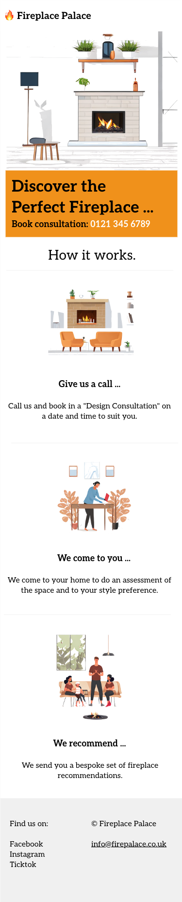

 
 


# Fireplace Palace
  This is a School of Code Challenge for bootcampers to build a working web application using react and nextJs. This web application has a landing page, founders' page and a booking form.  

## Table of Content 
- [Installation](#Installation)
- [Configuration](#Configuration)
- [Planning](#Planning)
- [Resources_links](#Resources_links)
- [Feedback](#Feedback)Resources_links
- [License](#License)


## Installation 
 _Clone this repository first, then proceed to package installation and configuration._ 

### Packages and Frameworks installed 
 __React + NextJs__

__To install React + NextJs:__ 
Make sure you have Node.js and npm installed on your machine. You can download and install them from https://nodejs.org/.

__Install dependencies:__ Run the following command to install the project dependencies:

```
npm install
```
__Start the app:__ Run the following command to start the development server:
```
npm run dev
```
Explore more about react and nextJs and its features in the official documentation: [NextJs Documentation](https://nextjs.org/docs). 

## Configuration

__Vistest Configuration File:__

In the package.json file in the root of the project. Check if the scripts have the following code:

```
"scripts": {
    "dev": "next dev",
    "build": "next build",
    "start": "next start",
    "lint": "next lint"
  },
```
If not, add the code above.

## Planning
 As we do the planning for the project we focused on tackling one user criteria at a time.

 **Fist phase**
  - Creating a landing page
  


 **Second phase**
  - Adding the founders page
  


 **Third phase**
  - Adding a booking form
  

  
 **Final phase**
  - Validate the booking form
  

## Resources_links

Here are for resources used as guid in building the Fireplace Palace web application.

## Feedback

Click this [form](https://soc-hackathon-feedback.netlify.app/) for feedback and questions.

## License
[](https://opensource.org/licenses/MIT) .